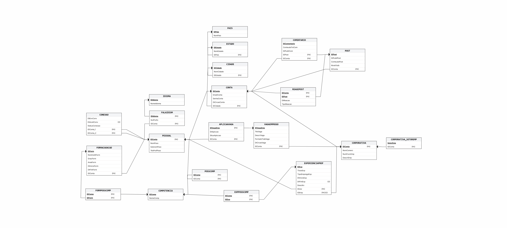

<div align="center">

```
 ██╗     ██╗███╗   ██╗██╗  ██╗███████╗██████╗ ██╗███╗   ██╗
 ██║     ██║████╗  ██║██║ ██╔╝██╔════╝██╔══██╗██║████╗  ██║
 ██║     ██║██╔██╗ ██║█████╔╝ █████╗  ██║  ██║██║██╔██╗ ██║
 ██║     ██║██║╚██╗██║██╔═██╗ ██╔══╝  ██║  ██║██║██║╚██╗██║
 ███████╗██║██║ ╚████║██║  ██╗███████╗██████╔╝██║██║ ╚████║
 ╚══════╝╚═╝╚═╝  ╚═══╝╚═╝  ╚═╝╚══════╝╚═════╝ ╚═╝╚═╝  ╚═══╝
```

**Interface CLI para interação com banco de dados relacional inspirado no LinkedIn**


</div>

---

## 📖 Sobre o Projeto

Este projeto implementa uma **interface de linha de comando (CLI)** completa para gerenciar um banco de dados relacional modelado com base nas entidades do LinkedIn. A aplicação permite realizar operações **CRUD** (Create, Read, Update, Delete) sobre todas as 20 tabelas do schema, com uma interface visual estilizada inspirada no [neofetch](https://github.com/dylanaraps/neofetch).

O banco de dados cobre entidades como contas pessoais e corporativas, posts, comentários, vagas de emprego, competências, formações acadêmicas, experiências profissionais, idiomas e conexões entre usuários — totalizando suporte a **mais de 100.000 registros** na carga massiva de dados.

---

## 👥 Autores

| Nome | GitHub |
|------|--------|
| José Pedro Dresch | [@josepedrodresch](https://github.com/josepedrodresch) |
| Phelipe Gabriel Lima da Silva | [@phelipegabriel](https://github.com/phelipegabriel) |
| Murilo Granemann de Souza | [@murilogranemann](https://github.com/murilogranemann) |
| Luis Eduardo Weigert Weiss | [@luiseduardo](https://github.com/luiseduardo) |

---

## 🗂️ Estrutura do Repositório

```
linkedin-db/
├── app.py                 # Aplicação CLI principal
├── schema.sql             # DDL: criação das tabelas e constraints
├── inserts.sql            # DML: dados iniciais + carga massiva (100k+ registros)
├── indices.sql            # Demonstração de análise de índices com EXPLAIN ANALYZE
├── relational_schema.png  # Diagrama do esquema relacional
├── README.md
└── LICENSE
```

---

## 🗄️ Esquema Relacional

O banco é composto por **20 tabelas** organizadas em torno da entidade central `CONTA`:



<details>
<summary>Ver lista completa de tabelas</summary>

| Tabela | Descrição |
|--------|-----------|
| `PAIS`, `ESTADO`, `CIDADE` | Localização geográfica |
| `CONTA` | Entidade central — toda conta tem email e senha |
| `PESSOAL` | Perfil pessoal (nome, sobrenome, título profissional) |
| `CORPORATIVA` | Perfil de empresa (nome comercial, setor, nº de funcionários) |
| `CORPORATIVA_SETOREMP` | Setores de atuação da empresa |
| `COMPETENCIA`, `POSSCOMP` | Competências e vínculo com contas pessoais |
| `IDIOMA`, `FALAIDIOM` | Idiomas e nível de proficiência por conta |
| `FORMACAOACAD`, `FORMPOSSCOMP` | Formação acadêmica e competências adquiridas |
| `EXPERIENCIAPROF`, `EXPPOSSCOMP` | Experiência profissional e competências relacionadas |
| `VAGAEMPREGO`, `APLICAAVAGA` | Vagas publicadas por empresas e candidaturas |
| `POST`, `COMENTARIO`, `REAGEPOST` | Feed social: posts, comentários e reações |
| `CONEXAO` | Rede de conexões entre perfis pessoais |

</details>

---

## ⚙️ Requisitos

### Sistema Operacional
- Linux, macOS ou Windows (com suporte a terminal ANSI para cores)

### Python
- Python **3.8 ou superior**

```bash
python3 --version
```

### PostgreSQL
- PostgreSQL **13 ou superior** instalado e rodando

```bash
psql --version
```

### Dependências Python

Instale via pip:

```bash
pip install psycopg2-binary
```

> **Nota:** `psycopg2-binary` inclui os binários compilados e não exige instalação manual do `libpq-dev`. Em produção, prefira o pacote `psycopg2` com as dependências do sistema instaladas.

---

## 🚀 Como Rodar

### 1. Clone o repositório

```bash
git clone https://github.com/seu-usuario/linkedin-db.git
cd linkedin-db
```

### 2. Configure o banco de dados

Crie o banco no PostgreSQL:

```bash
psql -U postgres -c "CREATE DATABASE linkedin;"
```

Aplique o schema:

```bash
psql -U postgres -d linkedin -f schema.sql
```

Carregue os dados iniciais e a carga massiva:

```bash
psql -U postgres -d linkedin -f inserts.sql
```

> ⚠️ A carga massiva insere **~100.000 contas**, **~10.000 empresas** e dados relacionados. O processo pode levar alguns minutos dependendo do hardware.

### 3. Execute a aplicação

```bash
python3 app.py
```

Ao iniciar, você verá a splash screen estilo neofetch com informações do sistema e da conexão. Se precisar alterar as credenciais do banco (host, porta, usuário, senha), pressione **`C`** no menu principal para acessar a tela de configuração.

**Credenciais padrão:**

| Parâmetro | Valor padrão |
|-----------|-------------|
| Host      | `localhost`  |
| Porta     | `5432`       |
| Banco     | `linkedin`   |
| Usuário   | `postgres`   |
| Senha     | `123`        |

---

## 🧭 Navegação na CLI

```
Menu Principal
├── [1]  Conta
├── [2]  Post
├── [3]  Comentário
├── [4]  Reagir a Post
├── [5]  Vaga de Emprego
├── [6]  Aplicação a Vaga
├── [7]  Competência
├── [8]  Competência da Conta
├── [9]  Comp. de Experiência
├── [10] Experiência Prof.
├── [11] Formação Acadêmica
├── [12] Comp. de Formação
├── [13] Idioma
├── [14] Idioma da Conta
├── [15] Conexão
├── [16] Setor de Empresa
├── [C]  Configurar conexão DB
└── [0]  Sair
```

Dentro de cada módulo, as operações disponíveis são exibidas como:

```
[1] ✚ Criar    [2] 🔍 Buscar    [3] ✎ Atualizar    [4] ✖ Deletar
```

---

## 🧪 Exemplos de Uso (CRUD)

Os exemplos abaixo usam a conta pessoal **Bruno Silva** (`IDConta = 2`) e a empresa **TechLink Solutions** (`IDConta = 1`), ambas presentes nos dados iniciais.

---

### ✚ CREATE — Criar um Post

No menu principal, selecione **`[2] Post`**, depois **`[1] ✚ Criar`**.

```
▶ Criar Post
──────────────────────────────────────────────

› Filtrar CONTA (Enter p/ listar): bruno
  [1] 2 - bruno@gmail.com

› Opção: 1

› Conteúdo do Post: Acabei de concluir minha certificação em AWS! 🚀
› Visibilidade (PUBLICO/PRIVADO) [PUBLICO]: PUBLICO

  ✔  Operação realizada com sucesso!
```

**Equivalente SQL:**
```sql
INSERT INTO POST (DtPubliPost, ConteudoPost, NivelVisib, IDConta)
VALUES (CURRENT_TIMESTAMP, 'Acabei de concluir minha certificação em AWS! 🚀', 'PUBLICO', 2);
```

---

### 🔍 READ — Buscar Experiências Profissionais

No menu principal, selecione **`[10] Experiência Prof.`**, depois **`[2] 🔍 Buscar`**.

```
▶ Buscar Experiências
──────────────────────────────────────────────

› Filtrar PESSOAL (Enter p/ listar): Bruno
  [1] 2 - Bruno

› Opção: 1

  ┌────────────────────────────────────────────────────────────┐
  │ ID:2 | Data Enginner @ TechLink Solutions
  │ Tipo: CLT | 2023-06-01 → 2025-01-15
  │ Descrição: Liderou migração de pipelines para cloud.
  └────────────────────────────────────────────────────────────┘
```

**Equivalente SQL:**
```sql
SELECT e.IDExp, e.TituloExp, e.TipoEmpregoExp, e.DtInicioExp, e.DtFimExp,
       e.DescAtv, c.NomComerc
FROM EXPERIENCIAPROF e
LEFT JOIN CORPORATIVA c ON e.IDEmp = c.IDConta
WHERE e.IDConta = 2;
```

---

### ✎ UPDATE — Atualizar Status de uma Candidatura

No menu principal, selecione **`[6] Aplicação a Vaga`**, depois **`[3] ✎ Atualizar`**.

```
▶ Atualizar Aplicação
──────────────────────────────────────────────

› ID da Vaga: 1
› ID da Conta: 2

▶ Novo Status (Atual: Enviada)
  [1] Enviada
  [2] Em Analise
  [3] Aprovada
  [4] Recusada

› Opção: 3

  ✔  Operação realizada com sucesso!
```

**Equivalente SQL:**
```sql
UPDATE APLICAAVAGA
SET SttusAplccao = 'Aprovada'
WHERE IDVagaEmp = 1 AND IDConta = 2;
```

---

### ✖ DELETE — Remover uma Conexão

No menu principal, selecione **`[15] Conexão`**, depois **`[4] ✖ Deletar`**.

```
▶ Remover Conexão
──────────────────────────────────────────────

› ID da Conta 1: 2
› ID da Conta 2: 3
› Confirmar remoção? (S/N): S

  ✔  Operação realizada com sucesso!
```

**Equivalente SQL:**
```sql
DELETE FROM CONEXAO
WHERE IDConta_1 = 2 AND IDConta_2 = 3;
```

---

## 📊 Demonstração de Índices

O arquivo `indices.sql` demonstra o ganho de performance ao criar um índice na coluna `NomPsso` da tabela `PESSOAL`, que conta com **~90.000 registros** inseridos pela carga massiva.

### Execute o arquivo:

```bash
psql -U postgres -d linkedin -f indices.sql
```

### Resultado esperado

**Sem índice** — PostgreSQL realiza um *Sequential Scan* varrendo toda a tabela:

```
Seq Scan on pessoal  (cost=0.00..2143.00 rows=4 width=12)
                     (actual time=0.842..18.543 rows=9 loops=1)
  Filter: ((nompsso)::text = 'Julio')
  Rows Removed by Filter: 89991
Planning Time: 0.102 ms
Execution Time: 18.601 ms
```

**Com índice** — PostgreSQL usa *Index Scan*, buscando diretamente as linhas relevantes:

```sql
CREATE INDEX idx_conta ON PESSOAL(NomPsso);
```

```
Index Scan using idx_conta on pessoal  (cost=0.29..12.34 rows=4 width=12)
                                        (actual time=0.045..0.071 rows=9 loops=1)
  Index Cond: ((nompsso)::text = 'Julio')
Planning Time: 0.241 ms
Execution Time: 0.089 ms
```

> O tempo de execução cai de **~18ms para ~0.09ms** — uma melhoria de aproximadamente **200×** para buscas por nome exato em tabelas de grande volume.

---

## 🔒 Observações de Segurança

- As senhas no `inserts.sql` são armazenadas em texto plano (`'123'`) para fins de desenvolvimento e testes. Em produção, utilize hashing (ex: `bcrypt`).
- A FK `EXPERIENCIAPROF.IDEmp → CORPORATIVA.IDConta` foi declarada sem `ON DELETE CASCADE` intencionalmente: ao deletar uma empresa, o histórico de experiência profissional dos usuários é preservado (apenas o vínculo com a empresa é desfeito, setando `IDEmp = NULL`). A aplicação trata esse caso automaticamente.

---

## 📄 Licença

Distribuído sob a licença MIT. Veja o arquivo [`LICENSE`](LICENSE) para mais detalhes.
